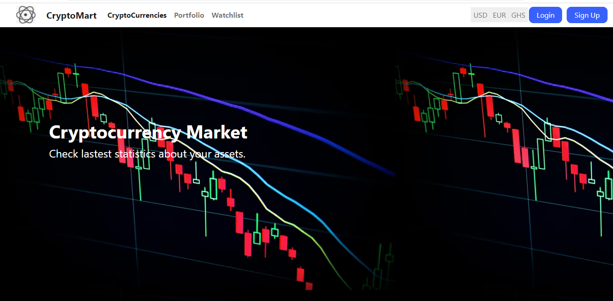
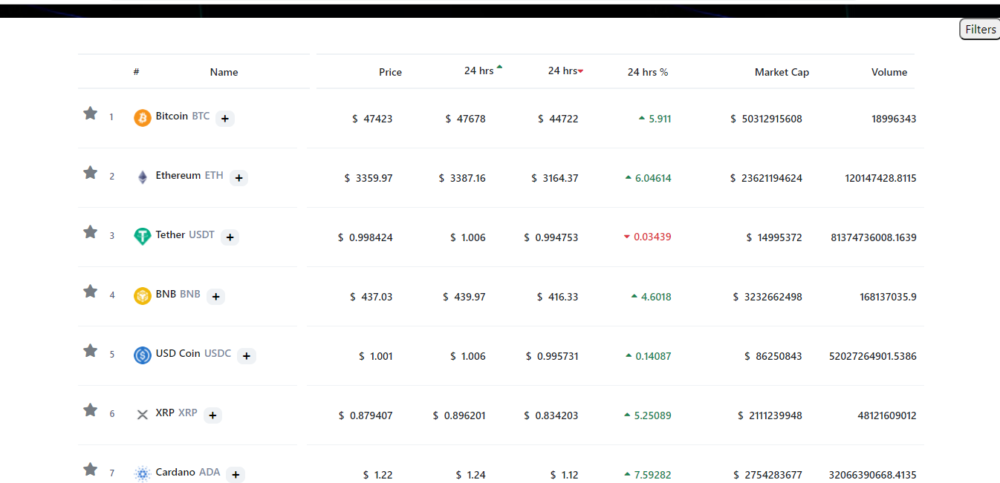
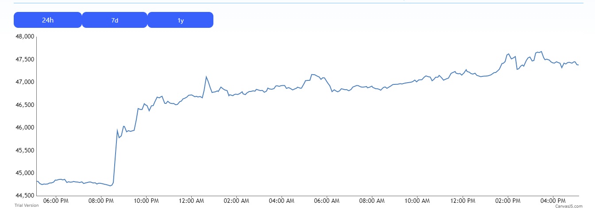

# Project Title: Cryptocurrency Market

# Project Objective

An application thats gives lastest statistics about user assets and also allow user to add assets and get information about their assets.

### Customer Requirements

Users should be able to:
- View active cryptocurrencies with latest market data and sort.
- View information about a cryptocurrency
- Add new asset to his/her portfolio
- View statistics about his/her asset
- Update his/her portfolio
- Get insights into his/her portfolio
-Add cryptocurrency to his/her watchlist 

### Links

- Frontend Solution URL: [https://github.com/Ramsonodoi/CryptocurrencyMarket](https://github.com/Ramsonodoi/CryptocurrencyMarket)
- Backend Solution URL: [https://github.com/ntiBoateng/cryptoBackend.git](https://github.com/ntiBoateng/cryptoBackend.git)

- Live Site URL: [https://cryptocurrency-market.netlify.app/](https://cryptocurrency-market.netlify.app)

### Landing Page

### CryptoCurrencies Table

### Detail of Every Coin

### Coin Chart

## Our process

A team of two developers, one front-end developer and one back-end developer used React and   

### Built with
   *Frontend Technologies*
- [React](https://reactjs.org/) - JS library
- [React Router](https://reactrouter.com/) - For user interfaces
- [Bootstrap](https://getbootstrap.com/) - For UI interface elements
- [MaterialUI](https://mui.com/) - Front-end framework for React Components
- [Canvasjs](https://canvasjs.com/) - Charting library

*Backend Technologies*
- [Express](https://expressjs.com/) - For Backend Server
- [MongoDB](https://www.mongodb.com/) - For Database

## Services
- [CoinMarketCap API](https://coinmarketcap.com/api/documentation/v1/)
- [CoinGecko API v3](https://www.coingecko.com/api/documentations/v3)

## Versioning
- [Git](https://git-scm.com/) is used for version control.

## Authors
- GitHub - [Ramson Odoi](https://github.com/Ramsonodoi)
- GitHub - [Gideon Nti Boateng](https://github.com/ntiBoateng)

## Available Scripts

In the project directory, you can run:

### `npm start`

Runs the app in the development mode.\
Open [http://localhost:3000](http://localhost:3000) to view it in your browser.

The page will reload when you make changes.\
You may also see any lint errors in the console.

### `npm test`

Launches the test runner in the interactive watch mode.\
See the section about [running tests](https://facebook.github.io/create-react-app/docs/running-tests) for more information.

### `npm run build`

Builds the app for production to the `build` folder.\
It correctly bundles React in production mode and optimizes the build for the best performance.

The build is minified and the filenames include the hashes.\
Your app is ready to be deployed!

See the section about [deployment](https://facebook.github.io/create-react-app/docs/deployment) for more information.

### `npm run eject`

**Note: this is a one-way operation. Once you `eject`, you can't go back!**

If you aren't satisfied with the build tool and configuration choices, you can `eject` at any time. This command will remove the single build dependency from your project.

Instead, it will copy all the configuration files and the transitive dependencies (webpack, Babel, ESLint, etc) right into your project so you have full control over them. All of the commands except `eject` will still work, but they will point to the copied scripts so you can tweak them. At this point you're on your own.

You don't have to ever use `eject`. The curated feature set is suitable for small and middle deployments, and you shouldn't feel obligated to use this feature. However we understand that this tool wouldn't be useful if you couldn't customize it when you are ready for it.

## Learn More

You can learn more in the [Create React App documentation](https://facebook.github.io/create-react-app/docs/getting-started).

To learn React, check out the [React documentation](https://reactjs.org/).

### Code Splitting

This section has moved here: [https://facebook.github.io/create-react-app/docs/code-splitting](https://facebook.github.io/create-react-app/docs/code-splitting)

### Analyzing the Bundle Size

This section has moved here: [https://facebook.github.io/create-react-app/docs/analyzing-the-bundle-size](https://facebook.github.io/create-react-app/docs/analyzing-the-bundle-size)

### Making a Progressive Web App

This section has moved here: [https://facebook.github.io/create-react-app/docs/making-a-progressive-web-app](https://facebook.github.io/create-react-app/docs/making-a-progressive-web-app)

### Advanced Configuration

This section has moved here: [https://facebook.github.io/create-react-app/docs/advanced-configuration](https://facebook.github.io/create-react-app/docs/advanced-configuration)

### Deployment

This section has moved here: [https://facebook.github.io/create-react-app/docs/deployment](https://facebook.github.io/create-react-app/docs/deployment)

### `npm run build` fails to minify

This section has moved here: [https://facebook.github.io/create-react-app/docs/troubleshooting#npm-run-build-fails-to-minify](https://facebook.github.io/create-react-app/docs/troubleshooting#npm-run-build-fails-to-minify)

# Project Title: Cryptocurrency Market

# Project Objective

An application thats gives lastest statistics about user assets and also allow user to add assets and get information about their assets.

### Customer Requirements

Users should be able to:
- View active cryptocurrencies with latest market data and sort.
- View information about a cryptocurrency
- Add new asset to his/her portfolio
- View statistics about his/her asset
- Update his/her portfolio
- Get insights into his/her portfolio
-Add cryptocurrency to his/her watchlist 

### Links

- Frontend Solution URL: [https://github.com/Ramsonodoi/CryptocurrencyMarket](https://github.com/Ramsonodoi/CryptocurrencyMarket)
- Backend Solution URL: [https://github.com/ntiBoateng/cryptoBackend.git](https://github.com/ntiBoateng/cryptoBackend.git)

- Live Site URL: [https://cryptocurrency-market.netlify.app/](https://cryptocurrency-market.netlify.app)

### Landing Page

### CryptoCurrencies Table

### Detail of Every Coin

### Coin Chart

## Our process

A team of two developers, one front-end developer and one back-end developer used React and   

### Built with
   *Frontend Technologies*
- [React](https://reactjs.org/) - JS library
- [React Router](https://reactrouter.com/) - For user interfaces
- [Bootstrap](https://getbootstrap.com/) - For UI interface elements
- [MaterialUI](https://mui.com/) - Front-end framework for React Components
- [Canvasjs](https://canvasjs.com/) - Charting library

*Backend Technologies*
- [Express](https://expressjs.com/) - For Backend Server
- [MongoDB](https://www.mongodb.com/) - For Database

## Services
- [CoinMarketCap API](https://coinmarketcap.com/api/documentation/v1/)
- [CoinGecko API v3](https://www.coingecko.com/api/documentations/v3)

## Versioning
- [Git](https://git-scm.com/) is used for version control.

## Authors
- GitHub - [Ramson Odoi](https://github.com/Ramsonodoi)
- GitHub - [Gideon Nti Boateng](https://github.com/ntiBoateng)

## Available Scripts

In the project directory, you can run:

### `npm start`

Runs the app in the development mode.\
Open [http://localhost:3000](http://localhost:3000) to view it in your browser.

The page will reload when you make changes.\
You may also see any lint errors in the console.

### `npm test`

Launches the test runner in the interactive watch mode.\
See the section about [running tests](https://facebook.github.io/create-react-app/docs/running-tests) for more information.

### `npm run build`

Builds the app for production to the `build` folder.\
It correctly bundles React in production mode and optimizes the build for the best performance.

The build is minified and the filenames include the hashes.\
Your app is ready to be deployed!

See the section about [deployment](https://facebook.github.io/create-react-app/docs/deployment) for more information.

### `npm run eject`

**Note: this is a one-way operation. Once you `eject`, you can't go back!**

If you aren't satisfied with the build tool and configuration choices, you can `eject` at any time. This command will remove the single build dependency from your project.

Instead, it will copy all the configuration files and the transitive dependencies (webpack, Babel, ESLint, etc) right into your project so you have full control over them. All of the commands except `eject` will still work, but they will point to the copied scripts so you can tweak them. At this point you're on your own.

You don't have to ever use `eject`. The curated feature set is suitable for small and middle deployments, and you shouldn't feel obligated to use this feature. However we understand that this tool wouldn't be useful if you couldn't customize it when you are ready for it.

## Learn More

You can learn more in the [Create React App documentation](https://facebook.github.io/create-react-app/docs/getting-started).

To learn React, check out the [React documentation](https://reactjs.org/).

### Code Splitting

This section has moved here: [https://facebook.github.io/create-react-app/docs/code-splitting](https://facebook.github.io/create-react-app/docs/code-splitting)

### Analyzing the Bundle Size

This section has moved here: [https://facebook.github.io/create-react-app/docs/analyzing-the-bundle-size](https://facebook.github.io/create-react-app/docs/analyzing-the-bundle-size)

### Making a Progressive Web App

This section has moved here: [https://facebook.github.io/create-react-app/docs/making-a-progressive-web-app](https://facebook.github.io/create-react-app/docs/making-a-progressive-web-app)

### Advanced Configuration

This section has moved here: [https://facebook.github.io/create-react-app/docs/advanced-configuration](https://facebook.github.io/create-react-app/docs/advanced-configuration)

### Deployment

This section has moved here: [https://facebook.github.io/create-react-app/docs/deployment](https://facebook.github.io/create-react-app/docs/deployment)

### `npm run build` fails to minify

This section has moved here: [https://facebook.github.io/create-react-app/docs/troubleshooting#npm-run-build-fails-to-minify](https://facebook.github.io/create-react-app/docs/troubleshooting#npm-run-build-fails-to-minify)

# Project Title: Cryptocurrency Market

# Project Objective

An application thats gives lastest statistics about user assets and also allow user to add assets and get information about their assets.

### Customer Requirements

Users should be able to:
- View active cryptocurrencies with latest market data and sort.
- View information about a cryptocurrency
- Add new asset to his/her portfolio
- View statistics about his/her asset
- Update his/her portfolio
- Get insights into his/her portfolio
-Add cryptocurrency to his/her watchlist 

### Links

- Frontend Solution URL: [https://github.com/Ramsonodoi/CryptocurrencyMarket](https://github.com/Ramsonodoi/CryptocurrencyMarket)
- Backend Solution URL: [https://github.com/ntiBoateng/cryptoBackend.git](https://github.com/ntiBoateng/cryptoBackend.git)

- Live Site URL: [https://cryptocurrency-market.netlify.app/](https://cryptocurrency-market.netlify.app)

### Landing Page

### CryptoCurrencies Table

### Detail of Every Coin

### Coin Chart

## Our process

A team of two developers, one front-end developer and one back-end developer used React and   

### Built with
   *Frontend Technologies*
- [React](https://reactjs.org/) - JS library
- [React Router](https://reactrouter.com/) - For user interfaces
- [Bootstrap](https://getbootstrap.com/) - For UI interface elements
- [MaterialUI](https://mui.com/) - Front-end framework for React Components
- [Canvasjs](https://canvasjs.com/) - Charting library

*Backend Technologies*
- [Express](https://expressjs.com/) - For Backend Server
- [MongoDB](https://www.mongodb.com/) - For Database

## Services
- [CoinMarketCap API](https://coinmarketcap.com/api/documentation/v1/)
- [CoinGecko API v3](https://www.coingecko.com/api/documentations/v3)

## Versioning
- [Git](https://git-scm.com/) is used for version control.

## Authors
- GitHub - [Ramson Odoi](https://github.com/Ramsonodoi)
- GitHub - [Gideon Nti Boateng](https://github.com/ntiBoateng)

## Available Scripts

In the project directory, you can run:

### `npm start`

Runs the app in the development mode.\
Open [http://localhost:3000](http://localhost:3000) to view it in your browser.

The page will reload when you make changes.\
You may also see any lint errors in the console.

### `npm test`

Launches the test runner in the interactive watch mode.\
See the section about [running tests](https://facebook.github.io/create-react-app/docs/running-tests) for more information.

### `npm run build`

Builds the app for production to the `build` folder.\
It correctly bundles React in production mode and optimizes the build for the best performance.

The build is minified and the filenames include the hashes.\
Your app is ready to be deployed!

See the section about [deployment](https://facebook.github.io/create-react-app/docs/deployment) for more information.

### `npm run eject`

**Note: this is a one-way operation. Once you `eject`, you can't go back!**

If you aren't satisfied with the build tool and configuration choices, you can `eject` at any time. This command will remove the single build dependency from your project.

Instead, it will copy all the configuration files and the transitive dependencies (webpack, Babel, ESLint, etc) right into your project so you have full control over them. All of the commands except `eject` will still work, but they will point to the copied scripts so you can tweak them. At this point you're on your own.

You don't have to ever use `eject`. The curated feature set is suitable for small and middle deployments, and you shouldn't feel obligated to use this feature. However we understand that this tool wouldn't be useful if you couldn't customize it when you are ready for it.

## Learn More

You can learn more in the [Create React App documentation](https://facebook.github.io/create-react-app/docs/getting-started).

To learn React, check out the [React documentation](https://reactjs.org/).

### Code Splitting

This section has moved here: [https://facebook.github.io/create-react-app/docs/code-splitting](https://facebook.github.io/create-react-app/docs/code-splitting)

### Analyzing the Bundle Size

This section has moved here: [https://facebook.github.io/create-react-app/docs/analyzing-the-bundle-size](https://facebook.github.io/create-react-app/docs/analyzing-the-bundle-size)

### Making a Progressive Web App

This section has moved here: [https://facebook.github.io/create-react-app/docs/making-a-progressive-web-app](https://facebook.github.io/create-react-app/docs/making-a-progressive-web-app)

### Advanced Configuration

This section has moved here: [https://facebook.github.io/create-react-app/docs/advanced-configuration](https://facebook.github.io/create-react-app/docs/advanced-configuration)

### Deployment

This section has moved here: [https://facebook.github.io/create-react-app/docs/deployment](https://facebook.github.io/create-react-app/docs/deployment)

### `npm run build` fails to minify

This section has moved here: [https://facebook.github.io/create-react-app/docs/troubleshooting#npm-run-build-fails-to-minify](https://facebook.github.io/create-react-app/docs/troubleshooting#npm-run-build-fails-to-minify)

# Project Title: Cryptocurrency Market

# Project Objective

An application thats gives lastest statistics about user assets and also allow user to add assets and get information about their assets.

### Customer Requirements

Users should be able to:
- View active cryptocurrencies with latest market data and sort.
- View information about a cryptocurrency
- Add new asset to his/her portfolio
- View statistics about his/her asset
- Update his/her portfolio
- Get insights into his/her portfolio
-Add cryptocurrency to his/her watchlist 

### Links

- Frontend Solution URL: [https://github.com/Ramsonodoi/CryptocurrencyMarket](https://github.com/Ramsonodoi/CryptocurrencyMarket)
- Backend Solution URL: [https://github.com/ntiBoateng/cryptoBackend.git](https://github.com/ntiBoateng/cryptoBackend.git)

- Live Site URL: [https://cryptocurrency-market.netlify.app/](https://cryptocurrency-market.netlify.app)

### Landing Page

### CryptoCurrencies Table

### Detail of Every Coin

### Coin Chart

## Our process

A team of two developers, one front-end developer and one back-end developer used React and   

### Built with
   *Frontend Technologies*
- [React](https://reactjs.org/) - JS library
- [React Router](https://reactrouter.com/) - For user interfaces
- [Bootstrap](https://getbootstrap.com/) - For UI interface elements
- [MaterialUI](https://mui.com/) - Front-end framework for React Components
- [Canvasjs](https://canvasjs.com/) - Charting library

*Backend Technologies*
- [Express](https://expressjs.com/) - For Backend Server
- [MongoDB](https://www.mongodb.com/) - For Database

## Services
- [CoinMarketCap API](https://coinmarketcap.com/api/documentation/v1/)
- [CoinGecko API v3](https://www.coingecko.com/api/documentations/v3)

## Versioning
- [Git](https://git-scm.com/) is used for version control.

## Authors
- GitHub - [Ramson Odoi](https://github.com/Ramsonodoi)
- GitHub - [Gideon Nti Boateng](https://github.com/ntiBoateng)

## Available Scripts

In the project directory, you can run:

### `npm start`

Runs the app in the development mode.\
Open [http://localhost:3000](http://localhost:3000) to view it in your browser.

The page will reload when you make changes.\
You may also see any lint errors in the console.

### `npm test`

Launches the test runner in the interactive watch mode.\
See the section about [running tests](https://facebook.github.io/create-react-app/docs/running-tests) for more information.

### `npm run build`

Builds the app for production to the `build` folder.\
It correctly bundles React in production mode and optimizes the build for the best performance.

The build is minified and the filenames include the hashes.\
Your app is ready to be deployed!

See the section about [deployment](https://facebook.github.io/create-react-app/docs/deployment) for more information.

### `npm run eject`

**Note: this is a one-way operation. Once you `eject`, you can't go back!**

If you aren't satisfied with the build tool and configuration choices, you can `eject` at any time. This command will remove the single build dependency from your project.

Instead, it will copy all the configuration files and the transitive dependencies (webpack, Babel, ESLint, etc) right into your project so you have full control over them. All of the commands except `eject` will still work, but they will point to the copied scripts so you can tweak them. At this point you're on your own.

You don't have to ever use `eject`. The curated feature set is suitable for small and middle deployments, and you shouldn't feel obligated to use this feature. However we understand that this tool wouldn't be useful if you couldn't customize it when you are ready for it.

## Learn More

You can learn more in the [Create React App documentation](https://facebook.github.io/create-react-app/docs/getting-started).

To learn React, check out the [React documentation](https://reactjs.org/).

### Code Splitting

This section has moved here: [https://facebook.github.io/create-react-app/docs/code-splitting](https://facebook.github.io/create-react-app/docs/code-splitting)

### Analyzing the Bundle Size

This section has moved here: [https://facebook.github.io/create-react-app/docs/analyzing-the-bundle-size](https://facebook.github.io/create-react-app/docs/analyzing-the-bundle-size)

### Making a Progressive Web App

This section has moved here: [https://facebook.github.io/create-react-app/docs/making-a-progressive-web-app](https://facebook.github.io/create-react-app/docs/making-a-progressive-web-app)

### Advanced Configuration

This section has moved here: [https://facebook.github.io/create-react-app/docs/advanced-configuration](https://facebook.github.io/create-react-app/docs/advanced-configuration)

### Deployment

This section has moved here: [https://facebook.github.io/create-react-app/docs/deployment](https://facebook.github.io/create-react-app/docs/deployment)

### `npm run build` fails to minify

This section has moved here: [https://facebook.github.io/create-react-app/docs/troubleshooting#npm-run-build-fails-to-minify](https://facebook.github.io/create-react-app/docs/troubleshooting#npm-run-build-fails-to-minify)

# Project Title: Cryptocurrency Market

# Project Objective

An application thats gives lastest statistics about user assets and also allow user to add assets and get information about their assets.

### Customer Requirements

Users should be able to:
- View active cryptocurrencies with latest market data and sort.
- View information about a cryptocurrency
- Add new asset to his/her portfolio
- View statistics about his/her asset
- Update his/her portfolio
- Get insights into his/her portfolio
-Add cryptocurrency to his/her watchlist 

### Links

- Frontend Solution URL: [https://github.com/Ramsonodoi/CryptocurrencyMarket](https://github.com/Ramsonodoi/CryptocurrencyMarket)
- Backend Solution URL: [https://github.com/ntiBoateng/cryptoBackend.git](https://github.com/ntiBoateng/cryptoBackend.git)

- Live Site URL: [https://cryptocurrency-market.netlify.app/](https://cryptocurrency-market.netlify.app)

### Landing Page

### CryptoCurrencies Table

### Detail of Every Coin

### Coin Chart

## Our process

A team of two developers, one front-end developer and one back-end developer used React and   

### Built with
   *Frontend Technologies*
- [React](https://reactjs.org/) - JS library
- [React Router](https://reactrouter.com/) - For user interfaces
- [Bootstrap](https://getbootstrap.com/) - For UI interface elements
- [MaterialUI](https://mui.com/) - Front-end framework for React Components
- [Canvasjs](https://canvasjs.com/) - Charting library

*Backend Technologies*
- [Express](https://expressjs.com/) - For Backend Server
- [MongoDB](https://www.mongodb.com/) - For Database

## Services
- [CoinMarketCap API](https://coinmarketcap.com/api/documentation/v1/)
- [CoinGecko API v3](https://www.coingecko.com/api/documentations/v3)

## Versioning
- [Git](https://git-scm.com/) is used for version control.

## Authors
- GitHub - [Ramson Odoi](https://github.com/Ramsonodoi)
- GitHub - [Gideon Nti Boateng](https://github.com/ntiBoateng)

## Available Scripts

In the project directory, you can run:

### `npm start`

Runs the app in the development mode.\
Open [http://localhost:3000](http://localhost:3000) to view it in your browser.

The page will reload when you make changes.\
You may also see any lint errors in the console.

### `npm test`

Launches the test runner in the interactive watch mode.\
See the section about [running tests](https://facebook.github.io/create-react-app/docs/running-tests) for more information.

### `npm run build`

Builds the app for production to the `build` folder.\
It correctly bundles React in production mode and optimizes the build for the best performance.

The build is minified and the filenames include the hashes.\
Your app is ready to be deployed!

See the section about [deployment](https://facebook.github.io/create-react-app/docs/deployment) for more information.

### `npm run eject`

**Note: this is a one-way operation. Once you `eject`, you can't go back!**

If you aren't satisfied with the build tool and configuration choices, you can `eject` at any time. This command will remove the single build dependency from your project.

Instead, it will copy all the configuration files and the transitive dependencies (webpack, Babel, ESLint, etc) right into your project so you have full control over them. All of the commands except `eject` will still work, but they will point to the copied scripts so you can tweak them. At this point you're on your own.

You don't have to ever use `eject`. The curated feature set is suitable for small and middle deployments, and you shouldn't feel obligated to use this feature. However we understand that this tool wouldn't be useful if you couldn't customize it when you are ready for it.

## Learn More

You can learn more in the [Create React App documentation](https://facebook.github.io/create-react-app/docs/getting-started).

To learn React, check out the [React documentation](https://reactjs.org/).

### Code Splitting

This section has moved here: [https://facebook.github.io/create-react-app/docs/code-splitting](https://facebook.github.io/create-react-app/docs/code-splitting)

### Analyzing the Bundle Size

This section has moved here: [https://facebook.github.io/create-react-app/docs/analyzing-the-bundle-size](https://facebook.github.io/create-react-app/docs/analyzing-the-bundle-size)

### Making a Progressive Web App

This section has moved here: [https://facebook.github.io/create-react-app/docs/making-a-progressive-web-app](https://facebook.github.io/create-react-app/docs/making-a-progressive-web-app)

### Advanced Configuration

This section has moved here: [https://facebook.github.io/create-react-app/docs/advanced-configuration](https://facebook.github.io/create-react-app/docs/advanced-configuration)

### Deployment

This section has moved here: [https://facebook.github.io/create-react-app/docs/deployment](https://facebook.github.io/create-react-app/docs/deployment)

### `npm run build` fails to minify

This section has moved here: [https://facebook.github.io/create-react-app/docs/troubleshooting#npm-run-build-fails-to-minify](https://facebook.github.io/create-react-app/docs/troubleshooting#npm-run-build-fails-to-minify)

# Project Title: Cryptocurrency Market

# Project Objective

An application thats gives lastest statistics about user assets and also allow user to add assets and get information about their assets.

### Customer Requirements

Users should be able to:
- View active cryptocurrencies with latest market data and sort.
- View information about a cryptocurrency
- Add new asset to his/her portfolio
- View statistics about his/her asset
- Update his/her portfolio
- Get insights into his/her portfolio
-Add cryptocurrency to his/her watchlist 

### Links

- Frontend Solution URL: [https://github.com/Ramsonodoi/CryptocurrencyMarket](https://github.com/Ramsonodoi/CryptocurrencyMarket)
- Backend Solution URL: [https://github.com/ntiBoateng/cryptoBackend.git](https://github.com/ntiBoateng/cryptoBackend.git)

- Live Site URL: [https://cryptocurrency-market.netlify.app/](https://cryptocurrency-market.netlify.app)

### Landing Page

### CryptoCurrencies Table

### Detail of Every Coin

### Coin Chart

## Our process

A team of two developers, one front-end developer and one back-end developer used React and   

### Built with
   *Frontend Technologies*
- [React](https://reactjs.org/) - JS library
- [React Router](https://reactrouter.com/) - For user interfaces
- [Bootstrap](https://getbootstrap.com/) - For UI interface elements
- [MaterialUI](https://mui.com/) - Front-end framework for React Components
- [Canvasjs](https://canvasjs.com/) - Charting library

*Backend Technologies*
- [Express](https://expressjs.com/) - For Backend Server
- [MongoDB](https://www.mongodb.com/) - For Database

## Services
- [CoinMarketCap API](https://coinmarketcap.com/api/documentation/v1/)
- [CoinGecko API v3](https://www.coingecko.com/api/documentations/v3)

## Versioning
- [Git](https://git-scm.com/) is used for version control.

## Authors
- GitHub - [Ramson Odoi](https://github.com/Ramsonodoi)
- GitHub - [Gideon Nti Boateng](https://github.com/ntiBoateng)

## Available Scripts

In the project directory, you can run:

### `npm start`

Runs the app in the development mode.\
Open [http://localhost:3000](http://localhost:3000) to view it in your browser.

The page will reload when you make changes.\
You may also see any lint errors in the console.

### `npm test`

Launches the test runner in the interactive watch mode.\
See the section about [running tests](https://facebook.github.io/create-react-app/docs/running-tests) for more information.

### `npm run build`

Builds the app for production to the `build` folder.\
It correctly bundles React in production mode and optimizes the build for the best performance.

The build is minified and the filenames include the hashes.\
Your app is ready to be deployed!

See the section about [deployment](https://facebook.github.io/create-react-app/docs/deployment) for more information.

### `npm run eject`

**Note: this is a one-way operation. Once you `eject`, you can't go back!**

If you aren't satisfied with the build tool and configuration choices, you can `eject` at any time. This command will remove the single build dependency from your project.

Instead, it will copy all the configuration files and the transitive dependencies (webpack, Babel, ESLint, etc) right into your project so you have full control over them. All of the commands except `eject` will still work, but they will point to the copied scripts so you can tweak them. At this point you're on your own.

You don't have to ever use `eject`. The curated feature set is suitable for small and middle deployments, and you shouldn't feel obligated to use this feature. However we understand that this tool wouldn't be useful if you couldn't customize it when you are ready for it.

## Learn More

You can learn more in the [Create React App documentation](https://facebook.github.io/create-react-app/docs/getting-started).

To learn React, check out the [React documentation](https://reactjs.org/).

### Code Splitting

This section has moved here: [https://facebook.github.io/create-react-app/docs/code-splitting](https://facebook.github.io/create-react-app/docs/code-splitting)

### Analyzing the Bundle Size

This section has moved here: [https://facebook.github.io/create-react-app/docs/analyzing-the-bundle-size](https://facebook.github.io/create-react-app/docs/analyzing-the-bundle-size)

### Making a Progressive Web App

This section has moved here: [https://facebook.github.io/create-react-app/docs/making-a-progressive-web-app](https://facebook.github.io/create-react-app/docs/making-a-progressive-web-app)

### Advanced Configuration

This section has moved here: [https://facebook.github.io/create-react-app/docs/advanced-configuration](https://facebook.github.io/create-react-app/docs/advanced-configuration)

### Deployment

This section has moved here: [https://facebook.github.io/create-react-app/docs/deployment](https://facebook.github.io/create-react-app/docs/deployment)

### `npm run build` fails to minify

This section has moved here: [https://facebook.github.io/create-react-app/docs/troubleshooting#npm-run-build-fails-to-minify](https://facebook.github.io/create-react-app/docs/troubleshooting#npm-run-build-fails-to-minify)

# Project Title: Cryptocurrency Market

# Project Objective

An application thats gives lastest statistics about user assets and also allow user to add assets and get information about their assets.

### Customer Requirements

Users should be able to:
- View active cryptocurrencies with latest market data and sort.
- View information about a cryptocurrency
- Add new asset to his/her portfolio
- View statistics about his/her asset
- Update his/her portfolio
- Get insights into his/her portfolio
-Add cryptocurrency to his/her watchlist 

### Links

- Frontend Solution URL: [https://github.com/Ramsonodoi/CryptocurrencyMarket](https://github.com/Ramsonodoi/CryptocurrencyMarket)
- Backend Solution URL: [https://github.com/ntiBoateng/cryptoBackend.git](https://github.com/ntiBoateng/cryptoBackend.git)

- Live Site URL: [https://cryptocurrency-market.netlify.app/](https://cryptocurrency-market.netlify.app)

### Landing Page

### CryptoCurrencies Table

### Detail of Every Coin

### Coin Chart

## Our process

A team of two developers, one front-end developer and one back-end developer used React and   

### Built with
   *Frontend Technologies*
- [React](https://reactjs.org/) - JS library
- [React Router](https://reactrouter.com/) - For user interfaces
- [Bootstrap](https://getbootstrap.com/) - For UI interface elements
- [MaterialUI](https://mui.com/) - Front-end framework for React Components
- [Canvasjs](https://canvasjs.com/) - Charting library

*Backend Technologies*
- [Express](https://expressjs.com/) - For Backend Server
- [MongoDB](https://www.mongodb.com/) - For Database

## Services
- [CoinMarketCap API](https://coinmarketcap.com/api/documentation/v1/)
- [CoinGecko API v3](https://www.coingecko.com/api/documentations/v3)

## Versioning
- [Git](https://git-scm.com/) is used for version control.

## Authors
- GitHub - [Ramson Odoi](https://github.com/Ramsonodoi)
- GitHub - [Gideon Nti Boateng](https://github.com/ntiBoateng)

## Available Scripts

In the project directory, you can run:

### `npm start`

Runs the app in the development mode.\
Open [http://localhost:3000](http://localhost:3000) to view it in your browser.

The page will reload when you make changes.\
You may also see any lint errors in the console.

### `npm test`

Launches the test runner in the interactive watch mode.\
See the section about [running tests](https://facebook.github.io/create-react-app/docs/running-tests) for more information.

### `npm run build`

Builds the app for production to the `build` folder.\
It correctly bundles React in production mode and optimizes the build for the best performance.

The build is minified and the filenames include the hashes.\
Your app is ready to be deployed!

See the section about [deployment](https://facebook.github.io/create-react-app/docs/deployment) for more information.

### `npm run eject`

**Note: this is a one-way operation. Once you `eject`, you can't go back!**

If you aren't satisfied with the build tool and configuration choices, you can `eject` at any time. This command will remove the single build dependency from your project.

Instead, it will copy all the configuration files and the transitive dependencies (webpack, Babel, ESLint, etc) right into your project so you have full control over them. All of the commands except `eject` will still work, but they will point to the copied scripts so you can tweak them. At this point you're on your own.

You don't have to ever use `eject`. The curated feature set is suitable for small and middle deployments, and you shouldn't feel obligated to use this feature. However we understand that this tool wouldn't be useful if you couldn't customize it when you are ready for it.

## Learn More

You can learn more in the [Create React App documentation](https://facebook.github.io/create-react-app/docs/getting-started).

To learn React, check out the [React documentation](https://reactjs.org/).

### Code Splitting

This section has moved here: [https://facebook.github.io/create-react-app/docs/code-splitting](https://facebook.github.io/create-react-app/docs/code-splitting)

### Analyzing the Bundle Size

This section has moved here: [https://facebook.github.io/create-react-app/docs/analyzing-the-bundle-size](https://facebook.github.io/create-react-app/docs/analyzing-the-bundle-size)

### Making a Progressive Web App

This section has moved here: [https://facebook.github.io/create-react-app/docs/making-a-progressive-web-app](https://facebook.github.io/create-react-app/docs/making-a-progressive-web-app)

### Advanced Configuration

This section has moved here: [https://facebook.github.io/create-react-app/docs/advanced-configuration](https://facebook.github.io/create-react-app/docs/advanced-configuration)

### Deployment

This section has moved here: [https://facebook.github.io/create-react-app/docs/deployment](https://facebook.github.io/create-react-app/docs/deployment)

### `npm run build` fails to minify

This section has moved here: [https://facebook.github.io/create-react-app/docs/troubleshooting#npm-run-build-fails-to-minify](https://facebook.github.io/create-react-app/docs/troubleshooting#npm-run-build-fails-to-minify)

# Project Title: Cryptocurrency Market

# Project Objective

An application thats gives lastest statistics about user assets and also allow user to add assets and get information about their assets.

### Customer Requirements

Users should be able to:
- View active cryptocurrencies with latest market data and sort.
- View information about a cryptocurrency
- Add new asset to his/her portfolio
- View statistics about his/her asset
- Update his/her portfolio
- Get insights into his/her portfolio
-Add cryptocurrency to his/her watchlist 

### Links

- Frontend Solution URL: [https://github.com/Ramsonodoi/CryptocurrencyMarket](https://github.com/Ramsonodoi/CryptocurrencyMarket)
- Backend Solution URL: [https://github.com/ntiBoateng/cryptoBackend.git](https://github.com/ntiBoateng/cryptoBackend.git)

- Live Site URL: [https://cryptocurrency-market.netlify.app/](https://cryptocurrency-market.netlify.app)

### Landing Page

### CryptoCurrencies Table

### Detail of Every Coin

### Coin Chart

## Our process

A team of two developers, one front-end developer and one back-end developer used React and   

### Built with
   *Frontend Technologies*
- [React](https://reactjs.org/) - JS library
- [React Router](https://reactrouter.com/) - For user interfaces
- [Bootstrap](https://getbootstrap.com/) - For UI interface elements
- [MaterialUI](https://mui.com/) - Front-end framework for React Components
- [Canvasjs](https://canvasjs.com/) - Charting library

*Backend Technologies*
- [Express](https://expressjs.com/) - For Backend Server
- [MongoDB](https://www.mongodb.com/) - For Database

## Services
- [CoinMarketCap API](https://coinmarketcap.com/api/documentation/v1/)
- [CoinGecko API v3](https://www.coingecko.com/api/documentations/v3)

## Versioning
- [Git](https://git-scm.com/) is used for version control.

## Authors
- GitHub - [Ramson Odoi](https://github.com/Ramsonodoi)
- GitHub - [Gideon Nti Boateng](https://github.com/ntiBoateng)

## Available Scripts

In the project directory, you can run:

### `npm start`

Runs the app in the development mode.\
Open [http://localhost:3000](http://localhost:3000) to view it in your browser.

The page will reload when you make changes.\
You may also see any lint errors in the console.

### `npm test`

Launches the test runner in the interactive watch mode.\
See the section about [running tests](https://facebook.github.io/create-react-app/docs/running-tests) for more information.

### `npm run build`

Builds the app for production to the `build` folder.\
It correctly bundles React in production mode and optimizes the build for the best performance.

The build is minified and the filenames include the hashes.\
Your app is ready to be deployed!

See the section about [deployment](https://facebook.github.io/create-react-app/docs/deployment) for more information.

### `npm run eject`

**Note: this is a one-way operation. Once you `eject`, you can't go back!**

If you aren't satisfied with the build tool and configuration choices, you can `eject` at any time. This command will remove the single build dependency from your project.

Instead, it will copy all the configuration files and the transitive dependencies (webpack, Babel, ESLint, etc) right into your project so you have full control over them. All of the commands except `eject` will still work, but they will point to the copied scripts so you can tweak them. At this point you're on your own.

You don't have to ever use `eject`. The curated feature set is suitable for small and middle deployments, and you shouldn't feel obligated to use this feature. However we understand that this tool wouldn't be useful if you couldn't customize it when you are ready for it.

## Learn More

You can learn more in the [Create React App documentation](https://facebook.github.io/create-react-app/docs/getting-started).

To learn React, check out the [React documentation](https://reactjs.org/).

### Code Splitting

This section has moved here: [https://facebook.github.io/create-react-app/docs/code-splitting](https://facebook.github.io/create-react-app/docs/code-splitting)

### Analyzing the Bundle Size

This section has moved here: [https://facebook.github.io/create-react-app/docs/analyzing-the-bundle-size](https://facebook.github.io/create-react-app/docs/analyzing-the-bundle-size)

### Making a Progressive Web App

This section has moved here: [https://facebook.github.io/create-react-app/docs/making-a-progressive-web-app](https://facebook.github.io/create-react-app/docs/making-a-progressive-web-app)

### Advanced Configuration

This section has moved here: [https://facebook.github.io/create-react-app/docs/advanced-configuration](https://facebook.github.io/create-react-app/docs/advanced-configuration)

### Deployment

This section has moved here: [https://facebook.github.io/create-react-app/docs/deployment](https://facebook.github.io/create-react-app/docs/deployment)

### `npm run build` fails to minify

This section has moved here: [https://facebook.github.io/create-react-app/docs/troubleshooting#npm-run-build-fails-to-minify](https://facebook.github.io/create-react-app/docs/troubleshooting#npm-run-build-fails-to-minify)

